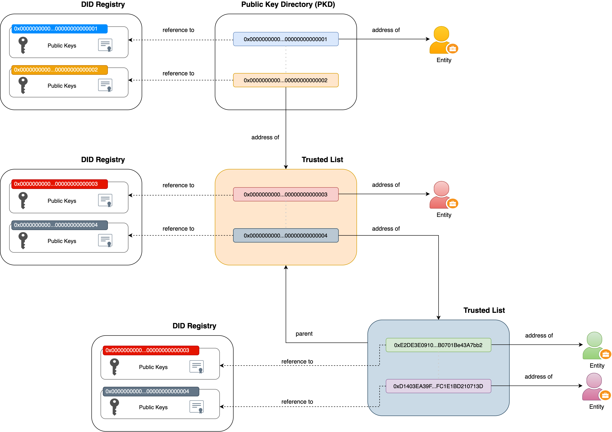

# LACChain On-Chain Public Key Directory 

This repository is an implementation of Root-of-Trust proposal of LACChain ID Stack.

Smart contracts helps to build a Root of Trust structure, by deploying a Public Key Directory (PKD) and a subset of Trusted List (TL) recursively to establish a hierarchy of entities.

The PKD extends its capabilities by accepting DIDs instead of just X.509 certificates for registered entities, allowing multiple public keys and giving each entity sovereignty to control and revoke them, without the need to alter the public directory.

On the other hand, the TL allow to maintain in the same way a list of entities identified by their DID, accepting multiple public keys, but also generating a TL hierarchy recursively.



## Testing

First rename `truffle-config.default` to `truffle-config.js` and edit to desired network configuration.

Make sure you don't have another version of truffle installed globally, then run:

```bash
$ npm install
$ truffle test
```

### Pre requisites
- NodeJS >= 12.4
- Truffle @ 5.1.67

## Deployment

1. Install [OpenZepellin CLI](https://docs.openzeppelin.com/cli/2.7/)
2. Install [OpenZepellin Contracts](https://github.com/OpenZeppelin/openzeppelin-contracts) (version 3.0.0)
3. Rename `truffle-config.default` to `truffle-config.js` and edit to desired network configuration.
4. Execute:

```bash
$ oz init
$ oz deploy
```

## Licence

Copyright 2021 LACChain

Licensed under the Apache License, Version 2.0 (the "License"); you may not use this file except in compliance with the License. You may obtain a copy of the License at

http://www.apache.org/licenses/LICENSE-2.0

Unless required by applicable law or agreed to in writing, software distributed under the License is distributed on an "AS IS" BASIS, WITHOUT WARRANTIES OR CONDITIONS OF ANY KIND, either express or implied. See the License for the specific language governing permissions and limitations under the License.